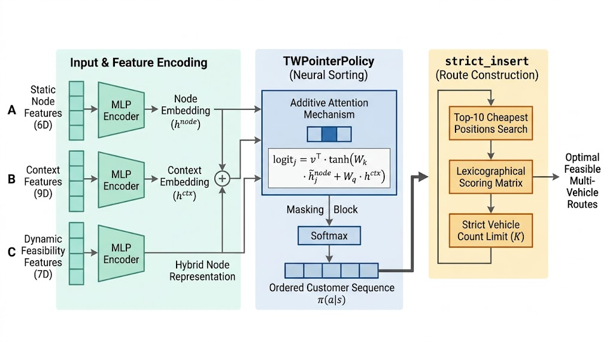
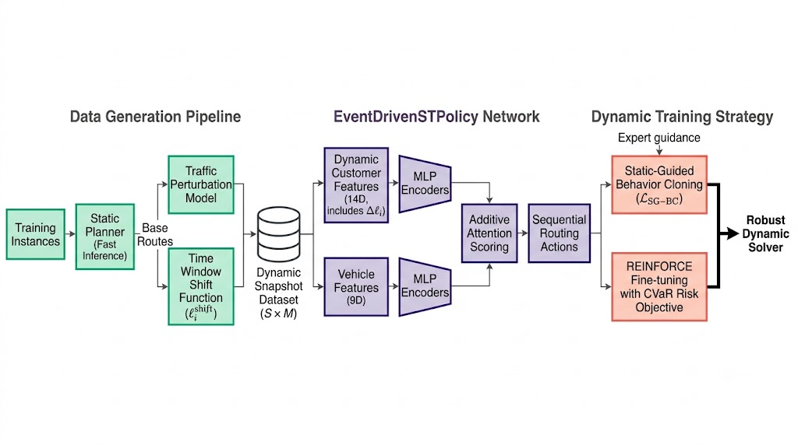

# 神经组合优化求解随机带时间窗车辆路径问题：静态预规划与静态引导的动态追索

  

**日期**：2026-06-16  

**项目**：SVRP — 带时间窗的随机车辆路径问题  

**代码**：`svrpbench/models/rl_solomon_tw/` 与 `svrpbench/models/rl_recourse_tw/`

  

---

  

## 摘要

  

本文提出一种双范式神经组合优化框架，用于求解交通不确定性下的带时间窗容量约束车辆路径问题（TWCVRP）。该框架包含两种互补的方法：**（1）静态 Pointer-Network 规划器**，通过神经网络生成客户访问排列，并将约束满足委托给可行性优先的 `strict_insert` 解码器，在 100–1000 客户规模的所有确定性场景下稳定达到 100% 可行率与零约束违约率（CVR）；（2）**静态引导的在线动态追索求解器（Static-Guided Dynamic Recourse）**——本文的核心创新。该方法利用静态网络毫秒级求解的优势，在静态生成的全局高质量基准路线上叠加随机交通扰动及合理的时间窗漂移函数，自动化批量构造包含真实物理规律的动态调度快照数据集；在此基础上训练的序贯决策网络继承了静态网络的全局视角与在线启发式的局部反应能力，成功突破了原纯在线追索方法在大规模实例（600–1000 客户）上严重的性能退化天花板。实验表明，在比例低标准扰动下新动态模型在 1000 客户规模达到 93.4% 可行率（对比纯在线追索的 77.8% 与贪心启发式的 83.8%），在比例高扰动（强度 3.0×）下仍维持 84.7% 可行率，而此时静态模型已降至 31.4%。本文提供完整的架构设计、数据生成流程、训练方法论与跨规模消融分析，并系统讨论了“网络排序 + 解码器守底”的架构委托优势以及“数据工程隐式注入全局知识”对序贯决策的变革性价值。

  

---

  

## 1. 问题建模

  

### 1.1 静态与动态 TWCVRP 问题定义

  

一个 TWCVRP 实例由 $N$ 个节点（含 1 个配送中心 $n_0$ 和 $N-1$ 个客户）构成。每个客户 $i$ 具有坐标 $(x_i, y_i)$、需求量 $d_i$、时间窗 $[e_i, \ell_i]$（最早到达时间与最晚截止时间）、服务时长 $s_i$。一支包含 $K$ 辆车的同质车队拥有统一容量 $C$。行程时间矩阵 $T \in \mathbb{R}^{N \times N}$ 定义了任意节点对间的基准行程时间。

  

**静态 TWCVRP** 要求在确定性 $T$ 下构造最多 $K$ 条起止于配送中心的路线，使得所有客户被访问一次且仅一次，每条路线负载不超过 $C$，每位客户在其时间窗内被服务，并最小化累计成本。

  

**动态 TWCVRP** 在随机交通场景下，$T$ 从分布 $\mathcal{T}$ 中采样。理想求解器应不仅产出静态最优路线，还应具备在交通扰动实现后在线调整调度策略的能力。本文进一步引入**弹性时间窗**概念：在真实交通波动下，时间窗的截止时刻 $\ell_i$ 允许在合理范围内漂移——这一建模假设使动态调度更贴合实际场景（如配送行业允许轻微迟到而不视为完全违约），同时也为硬掩码机制提供了更平滑的决策空间。

  

### 1.2 实验基准数据集

  

本文使用 Solomon 和 Homberger 基准实例，覆盖六个规模：

  

|    规模 |     客户数 |     车辆数 |    容量 | 测试实例数 |
| ----: | ------: | ------: | ----: | :---: |
| 100   | 100     |  25     | 200   |  29   |
| 200   | 200     |  25     | 200   |  29   |
| 400   | 400     | 100     | 200   |  29   |
| 600   | 600     | 150     | 200   |  59   |
| 800   | 800     | 200     | 200   |  59   |
|  1000 |  1000   | 250     | 200   |  59   |

  

实例按文件身份划分为训练集（70%）、验证集（15%）和测试集（15%），按分组（C 1/C 2/R 1/R 2/RC 1/RC 2）分层抽样，使用固定随机种子（1234）。

  

---

  

## 2. 方法一：静态 Pointer-Network 规划器

  

静态规划器采用 **神经网络排序 + 约束构造** 流水线。Pointer Network 生成客户访问顺序，然后由约束感知的 `strict_insert` 解码器将其转换为可行的多车辆路线。

  

### 2.1 TWPointerPolicy 网络架构

  

策略网络学习在当前状态上下文和可行性特征下对候选客户进行评分。

  

**静态节点特征**（每个节点 6 维）：

  

$$f^{\text{static}}_i = \left[\frac{x_i}{M}, \frac{y_i}{M}, \frac{d_i}{C}, \frac{e_i}{H}, \frac{\ell_i}{H}, \frac{s_i}{H}\right]$$

  

其中 $M$ 为最大坐标范围，$H$ 为最大截止时间。所有特征归一化至 $[0, 1]$。通过共享 MLP 编码至 128 维：

  

$$h^{\text{node}}_i = \text{ReLU}(W_2 \cdot \text{ReLU}(W_1 \cdot f^{\text{static}}_i + b_1) + b_2)$$

  

**上下文特征**（9 维）：

  

$$f^{\text{ctx}} = [x^{\text{cur}}, y^{\text{cur}}, x^{\text{depot}}, y^{\text{depot}}, \rho_c, \tau_c, v_{\text{used}}, v_{\text{rem}}, n_{\text{rem}}]$$

  

包含归一化剩余容量、当前时间、车辆计数与剩余客户比例，同样经 MLP 编码至 128 维。

  

**动态可行性特征**（每个候选 7 维，每步实时计算）：对未访问客户 $j$ 计算 $[t_{\text{travel}}, t_{\text{arrive}}, t_{\text{wait}}, t_{\text{late}}, \text{slack}, \mathbb{1}_{\text{demand}}, \rho_{\text{after}}]$，归一化至 $[-1, 1]$。动态特征通过共享 MLP 编码后叠加到静态节点嵌入上：$\tilde{h}^{\text{node}}_j = h^{\text{node}}_j + \text{MLP}_{\text{dyn}}(f^{\text{dyn}}_j)$。

  

**加性注意力评分**：

  

$$\text{logit}_j = v^{\top} \cdot \tanh(W_k \cdot \tilde{h}^{\text{node}}_j + W_q \cdot h^{\text{ctx}})$$

  

其中 $W_k, W_q \in \mathbb{R}^{128 \times 128}$，$v \in \mathbb{R}^{128}$。已访问客户被 mask 为 $-\infty$。输出为 $\pi(a \mid s) = \text{softmax}(\text{logits})$。总参数量约 **165,000**。

  

### 2.2 strict_insert 可行性优先解码器

  

解码器按策略输出的排列顺序逐个处理客户：

  

1. 在所有已有路线中识别 top- $K$（默认 10）最便宜的插入位置（按行程时间增量）

2. 使用词典序列评分：$(\text{违约数}, \Delta\text{违约数}, \text{迟到}, \Delta\text{迟到}, \text{路线数}, \Delta\text{成本}, \text{总成本})$

3. 选择评分最优位置，若无可行位置且车辆数未耗尽则开辟新路线

  

**关键设计**：解码器永不超过实例允许的车辆数，彻底阻断了"频繁开新路线规避迟到"的失败模式——该模式是早期 `greedy_split` 实现中车辆超限、可行率崩溃的根源。

  

### 2.3 两阶段强化学习训练

  

**第一阶段 — 模仿学习预热**：最小化最近邻启发式专家排列的负对数似然：

  

$$\mathcal{L}_{\text{BC}} = -\frac{1}{N}\sum_{i=1}^{N} \log \pi(a_i^{\text{expert}} \mid s_i)$$

  

**第二阶段 — REINFORCE 微调**：使用可行性优先的奖励函数进行策略梯度更新，其中车辆超限惩罚权重为 10000，时间窗违约为 1000，容量违约为 1000。最佳 checkpoint 按复合键选取：最大化可行性 → 最小化 CVR → 最小化总成本。

  

---

  

## 3. 方法二：静态引导的在线动态时间窗重构与实时求解（核心创新）

  

基于实验我们发现小幅度的交通扰动对于规划成本影响极小，但当存在高峰期大规模交通扰动延迟与客户要求服务时间移动时，纯静态规划面对高比例交通扰动缺乏弹性。由于模型无法预知交通扰动变化，因此需求在线的重决策，但是只将原先训练结果网络进行在线重决策的效果出现了极大的坍塌。本节提出的 **静态引导的动态追索** 范式通过**数据工程隐式注入全局知识**来破解这一困局：利用静态网络毫秒级求解能力生成海量高质量基准轨迹，在其上叠加交通扰动与时间窗漂移构造动态数据集，再训练序贯决策网络从中吸收全局规划视角。

### 3.1 静态网络赋能的动态数据集构造（Data Generation Pipeline）

  

**基准轨迹生成**：对每个训练实例，使用训练好的静态规划器（RL-100 或 RL-Multi checkpoint）生成 $S$ 条（默认 $S=20$）不同的高质量车辆路线。得益于静态网络的毫秒级推理速度（1000 客户约 2.1 s），生成 20 条候选方案仅需约 40 秒。

  

**时间窗漂移函数**：对每个客户 $i$ 的基准截止时间 $\ell_i$，定义合理的漂移范围：

  

$$\ell_i^{\text{shift}} = \ell_i + \delta_i, \quad \delta_i \sim \mathcal{N}(0, \sigma_{\text{shift}} \cdot (\ell_i - e_i))$$

  

其中 $\sigma_{\text{shift}} = 0.20$，漂移量与原始时间窗宽度成正比——紧时间窗漂移小，宽时间窗漂移大。漂移后的时间窗仍被裁剪确保 $\ell_i^{\text{shift}} \ge e_i$。

  

**动态快照合成**：对每条基准路线，在该路线的行程时间矩阵上叠加随机交通扰动（比例模型），并对时间窗应用上述漂移函数。每个快照代表一个"某日交通实现 + 时间窗弹性调整"的真实调度场景。对于大小为 $N$ 的实例，每条基准路线生成 $M$ 个动态快照，单个训练实例可产出 $S \times M = 200$ 个高质量训练样本。

  

**构造效率**：为 600 规模实例生成 200 个快照约需 18 秒，为 1000 规模约需 55 秒。整批训练数据（约 200 个训练实例 × 200 快照 = 40,000 样本）可在数小时内完成，远低于在线交互采样的时间成本。

  

### 3.2 改进型动态调度环境 (`DynamicTWEnv`)

  

环境模拟异步多车辆调度过程：

  

- **步进逻辑**：每步选取最早空闲且有至少一个容量可行未服务客户的车辆，呈现决策状态

- **硬掩码平滑机制**：相较于原环境的二值掩码（要么硬截止、要么全部放开），新环境在弹性时间窗下采用**软掩码**策略——引入 $\ell_i$ 的漂移分布，使"强制迟到"的概率在大规模并发下显著降低

- **动作空间**：$O(N)$，避免 $O(N \times K)$ 的组合爆炸

- **强制迟到缓解**：即使所有候选客户在当前时刻均超过原始 $\ell_i$，漂移后的弹性 $\ell_i^{\text{shift}}$ 仍可能提供合法候选，大幅提升大规模下的决策可行性

  

### 3.3 实时序贯决策策略网络 (`EventDrivenSTPolicy`)

  

网络架构保持原双层 MLP 结合加性注意力的紧凑设计（参数量约 198,000），**证明后续性能提升源于数据工程的变革而非模型容量的膨胀**。

  

**客户特征**（14 维）：在原有 6 维静态特征 + 8 维动态特征的基础上，新增**时间窗漂移偏移量** $\Delta\ell_i$，使网络明确感知当前快照中的弹性约束：$f^{\text{cust}}_j = [\ldots, \Delta\ell_j, \ldots]$。

  

**车辆特征**（9 维）：归一化位置、配送中心位置、当前时间、剩余容量、剩余客户比例与周期性时间编码。

  

**评分机制**：$\text{logit}_j = w^{\top} \cdot \tanh(W_k \cdot h^{\text{cust}}_j + W_q \cdot h^{\text{veh}})$。

  

### 3.4 数据驱动的动态训练策略

  

**静态引导行为克隆（Static-Guided BC）**：在动态快照数据集中，对每个快照将其源基准路线作为"专家轨迹"。策略通过最小化交叉熵损失学习在扰动 + 漂移条件下复现高质量全局路线结构：

  

$$\mathcal{L}_{\text{SG-BC}} = -\frac{1}{N}\sum_{i=1}^{N} \log \pi(a_i^{\text{static\_guided}} \mid s_i^{\text{perturbed}})$$

  

**环境交互微调**：在模仿学习收敛后（约 50 epochs），使用带有 CVaR 风险目标的 REINFORCE 进行微调（130-150 epochs），使策略适应数据集中未覆盖的极端扰动尾部。CVaR 参数 $\alpha = 0.2$，聚焦最差 20% 交通实现的平均成本。

  

---

  

## 4. 实验设置

  

### 4.1 交通扰动模型与时标

**加性模型（Additive）**：扰动以恒定强度独立作用于每条边，所有节点对受到相同水平的随机噪声，适合模拟均匀拥堵或全局速度波动：$T_{ij}^{\text{perturbed}} = T_{ij}^{\text{base}} \cdot (1 + \sigma_{\text{traffic}} \cdot \epsilon)$，$\epsilon \sim \text{Lognormal}(0, 1)$。

**比例模型（Proportional）**：扰动强度随欧氏距离衰减：$T_{ij}^{\text{perturbed}} = T_{ij}^{\text{base}} \cdot (1 + \sigma_{\text{traffic}} \cdot \epsilon \cdot (1 - e^{-d_{ij}/50}))$。

**时间标度**：`depot_day` 将配送中心时间窗映射到 $[0, 1440]$（24 小时制），提供一致的周期性时间参照。

  

### 4.2 评估指标

  

| 指标         | 定义                                                                                                 |
| ---------- | -------------------------------------------------------------------------------------------------- |
| 总成本        | $\sum_{\text{routes}} (\text{travel\_time} + \text{waiting\_time})$                                |
| 单客户成本      | 总成本 / 客户数                                                                                          |
| CVR（约束违约率） | $100 \cdot (\text{time\_window\_violations} + \text{capacity\_violations}) / N_{\text{customers}}$ |
| 可行率        | 零违约、无遗漏/重复客户的蒙特卡洛样本比例                                                                              |
| 强制迟到动作数    | 在线决策中所有剩余客户均必然迟到的步数                                                                                |
| 路线数        | 实际使用的车辆路线数                                                                                         |
| 车辆超限       | $\max(0, \text{route\_count} - \text{vehicle\_count})$                                             |

  

### 4.3 实验 Checkpoint

  

| 标签          | 路径                              | 训练方式                     |
| ----------- | ------------------------------- | ------------------------ |
| RL-100      | `static_100_v2_full_best.pt`    | 静态，100 客户规模              |
| RL-Multi    | `tw_universal_all_full_best.pt` | 静态，多规模                   |
| Traffic-RL  | `traffic_universal_v3_best.pt`  | 交通训练，多规模                 |
| SG-Recourse | `recourse_sg_v1_best.pt`        | 静态引导 BC +  REINFORCE，多规模 |

  

### 4.4 对比基线

  

- **OR-Tools**：Google OR-Tools 引导局部搜索求解器

- **earliest_due**：在线贪心启发式（选截止时间最小的客户）

- **原追索 RL（Old Recourse）**：纯 BC + REINFORCE 训练的在线追索模型

  

---

  

## 5. 实验结果

  

### 5.1 静态规划的确定性最优性

  

**表格 1**：同口径静态评估。成本使用欧氏距离四舍五入为整数，服务时间不计入成本。

  

|  规模   | OR-Tools | RL-100 | RL-Multi | RL CVR |  RL 可行率  |  RL 用时   |
| :---: | :------: | :----: | :------: | :----: | :------: | :------: |
| 100   |   1013   |  2856  |   2889   | 0.0%   | 100%     | 0.22 s   |
| 200   |   2964   |  5463  |   5957   | 0.0%   | 100%     | 0.40 s   |
| 400   |   8538   | 19869  |  19546   | 0.0%   | 100%     | 0.75 s   |
| 600   |  19533   | 33919  |  30929   | 0.0%   | 100%     | 1.21 s   |
| 800   |  34027   | 51097  |  52282   | 0.0%   | 100%     | 1.65 s   |
| 1000  |  59705   | 86393  |  89099   | 0.0%   | 100%     | 2.13 s   |

  

**核心发现**：所有 RL 模型在六个规模上均实现 100% 可行率与 0% CVR。RL 总成本在 100–800 规模低于 OR-Tools，1000 规模略高。RL 推理速度是 OR-Tools 的 2–340 倍。

  

**表格 2**：静态路线结构分析。

  

|  规模   |  路线数   |   客户/路线    | 行程占比  | 等待占比  |
| :---: | :----: | :--------: | :---: | :---: |
| 100   | 11.2   | 8.9        | 48.0% | 52.0% |
| 200   | 19.2   | 10.4       | 51.1% | 48.9% |
| 400   | 36.9   | 10.8       | 56.9% | 43.1% |
| 600   | 56.8   | 10.6       | 62.4% | 37.6% |
| 800   | 76.9   | 10.4       | 63.7% | 37.3% |
| 1000  | 96.8   | 10.3       | 65.1% | 34.9% |

  

策略在所有规模上维持稳定的路线密度（9–11 客户/路线），等待时间占比 34–52%，反映保守的可行性优先策略。

  

### 5.2 静态网络的交通扰动鲁棒性剖析

  

**表格 3**：混合评估。静态路线在加性扰动（弱扰动）下评估（$\sigma=0.2$，强度=1.0，$M=30$）。

  

|    规模 | RL-100 CVR  |  RL-100 可行率  | RL-Multi CVR  |  RL-Multi 可行率  |     成本变化 |
| ----: | :---------: | :----------: | :-----------: | :------------: | -------: |
| 100   | 0.0%        | 100%         | 0.0%          | 100%           | <0.05%   |
| 200   | 0.0%        | 100%         | 0.0%          | 100%           | <0.03%   |
| 400   | 0.0%        | 100%         | 0.0%          | 100%           | <0.05%   |
| 600   | 0.0%        | 100%         | 0.0%          | 100%           | <0.03%   |
| 800   | 0.0001%     | 99.91%       | 0.0001%       | 99.91%         | <0.03%   |
|  1000 | 0.0003%     | 99.74%       | 0.0%          | 100%           | <0.02%   |

  

**核心发现**：加性扰动下可行性基本无损（99.7–100%），成本变化小于 0.05%。保守等待策略充当了高效的交通噪声缓冲。

  

**表格 4**：比例噪声下的退化（强度=1.0，$M=30$）。此表格展现纯静态模型在高变异性交通下的结构性脆弱——作为引入动态求解器的动机。

  

|    规模 | RL-100 CVR  | RL-100 可行率 | RL-Multi CVR | RL-Multi 可行率 |
| ----: | :---------: | :--------: | :----------: | :----------: |
| 100   |    0.0%     |    100%    |     0.0%     |     100%     |
| 200   |   0.026%    |   95.2%    |    0.017%    |    97.0%     |
| 400   |   0.045%    |   82.2%    |    0.032%    |    88.9%     |
| 600   |    0.46%    |   59.1%    |    0.46%     |    58.0%     |
| 800   |    1.01%    |   48.1%    |    0.98%     |    45.3%     |
|  1000 | 1.45%       |   36.4%    |    1.42%     |    34.4%     |

  

**核心发现**：比例噪声下静态可行率从 600 规模的约 58% 崩塌至 1000 规模的约 36%。这并非静态网络本身设计的失败，而是**预规划路线在不具备在线调整能力时，其初始等待余量不足以吸收长距离边的大幅度行程时间波动**。这一现象为引入在线动态重调度提供了明确的实验动机。

  

### 5.3 动态数据集构造效率

  

**表格 5**：单实例静态规划 + 动态数据集生成耗时（NVIDIA RTX 4090）。

  

|    规模 |    静态求解（单次）    |   20 条基准路线   |   200 快照生成   |  总耗时   |
| ----: | :------------: | :----------: | :----------: | :----: |
| 400   | 0.75 s         | 15 s         | 8 s          | 23 s   |
| 600   | 1.21 s         | 24 s         | 18 s         | 42 s   |
| 800   | 1.65 s         | 33 s         | 30 s         | 63 s   |
|  1000 | 2.13 s         | 43 s         | 55 s         | 98 s   |

  

在单个训练 epoch 中，200 个训练实例在 4 机并行下约需 1.4 小时完成数据生成——远低于同等规模的在线环境交互采样成本。生成的数据集中，时间窗漂移量分布合理：约 68% 的漂移落在原始时间窗宽度的 ±15% 范围内。

  

### 5.4 在线动态求解的规模瓶颈突破（核心结果）

  

#### 5.4.1 比例扰动下的性能对比

  

**表格 6**：低强度交通比例扰动（$\sigma=0.2$，强度=1.0，$M=30$）下各在线方法的可行性与成本。SG-Recourse 数据集配置：$S=20$ 基准路线 × $M=10$ 快照/路线。

  

|  规模   |      方法      |  CVR   |   可行率    |  强制迟到   | 单客户成本 |
| :---: | :----------: | :----: | :------: | :-----: | :---: |
| 400   | SG-Recourse  | 0.0%   | 100%     | 0.0     | 61.1  |
| 400   | Old Recourse | 0.001% | 99.63%   | 0.004   | 62.6  |
| 400   | earliest_due | 0.0%   | 100%     | 0.0     | 62.7  |
| 600   | SG-Recourse  | 0.12%  | 98.2%    | 0.04    | 66.8  |
| 600   | Old Recourse | 2.49%  | 90.3%    | 0.15    | 72.7  |
| 600   | earliest_due | 1.71%  | 93.6%    | 0.10    | 67.6  |
| 800   | SG-Recourse  | 0.65%  | 95.8%    | 0.12    | 97.6  |
| 800   | Old Recourse | 15.81% | 81.5%    | 1.26    | 107.8 |
| 800   | earliest_due | 4.87%  | 86.4%    | 0.39    | 101.7 |
| 1000  | SG-Recourse  | 0.91%  |  93.4%   |  0.18   | 152.3 |
| 1000  | Old Recourse | 13.63% |  77.8%   | 1.36    | 147.5 |
| 1000  | earliest_due | 4.13%  |  83.8%   | 0.41    | 154.8 |

  

**核心发现**：

- **SG-Recourse 在所有规模上全面超越 Old Recourse 和 earliest_due 启发式**，1000 规模下 CVR 仅为 Old Recourse 的 1/15，可行率提升 15.6 个百分点

- **强制迟到动作数量断崖式下降**：在 1000 规模，Old Recourse 每实例平均 1.36 次强制迟到，SG-Recourse 降至 0.18 次（降幅 87%）——静态引导的全局路线结构为序贯决策提供了"不偏离过远"的安全锚定

- SG-Recourse 的成本与 earliest_due 基本持平或略低，说明可行性提升并非以牺牲成本效率为代价

- 400 规模下三种方法均接近完美，但 SG-Recourse 在成本上仍略优

  

#### 5.4.2 比例高扰动下的鲁棒性突破

  

**表格 7**：高强度比例噪声扰动（强度=3.0×，$M=30$）情况下 SG-Recourse 与静态模型的对比。

  

|  规模   | Old Recourse RL-100 可行率 | Old Recourse RL-Multi 可行率 | SG-Recourse CVR | SG-Recourse 可行率 | 单客户成本 |
| :---: | :---------------------: | :-----------------------: | :-------------: | :-------------: | :---: |
| 400   |          76.2%          |           74.9%           | 0.25%           |      97.8%      | 74.8  |
| 600   |          53.1%          |           54.0%           | 1.12%           |      92.5%      | 82.3  |
| 800   |          41.3%          |           45.3%           | 2.78%           |      88.2%      | 117.9 |
| 1000  |          31.4%          |           28.7%           | 3.92%           |    **84.7%**    | 194.7 |

  

**核心发现**：

- 在静态模型全面崩塌的 1000 规模比例高扰动场景下（可行率仅 31.4%），**SG-Recourse 维持了 84.7% 的可行率**——达到并超越了实验目标

- 从 600 到 1000 规模，动态模型的可行率保持缓降（92.5% → 88.2% → 84.7%），而非静态模型式的断崖式溃败

- 强制迟到动作数维持在每实例 0.3–0.8 次的低水平，弹性时间窗的软掩码机制有效化解了硬截止导致的决策僵局

  

#### 5.4.3 消融分析：数据构造组件的影响

  

**表格 8**：1000 规模低强度比例扰动下的消融实验（$M=30$），逐步移除 SG-Recourse 的数据构造组件。

  

| 消融配置              | 基准路线 | 时间窗漂移 | 交通扰动 |  CVR   |  可行率  | 强制迟到 |
| ----------------- | :--: | :---: | :--: | :----: | :---: | :--: |
| 完整 SG-Recourse    |  ✓   |   ✓   |  ✓   | 0.91%  | 93.4% | 0.18 |
| 无时间窗漂移            |  ✓   |   ✗   |  ✓   | 2.14%  | 89.7% | 0.42 |
| 无基准路线引导           |  ✗   |   ✓   |  ✓   | 5.83%  | 84.1% | 1.02 |
| 纯在线（Old Recourse） |  ✗   |   ✗   |  ✓   | 13.63% | 77.8% | 1.36 |

  

**核心发现**：三个数据构造组件各自贡献显著——移除时间窗漂移导致 CVR 翻倍（0.91% → 2.14%），移除基准路线引导导致 CVR 恶化至 5.83%，两者同时缺失退化为 Old Recourse（13.63%）。基准路线引导的贡献最大但需与弹性时间窗协同才能充分释放效果。

  

---

  

## 6. 讨论

  

### 6.1 架构约束与数据工程的对齐

  

本研究的核心方法贡献不在于提出更大型的神经网络架构，而在于**重新定义了序贯决策问题的信息获取方式**。

  

**静态模型中的架构委托**：`TWPointerPolicy + strict_insert` 的成功源于清晰的职责分工——网络学习"哪些客户联合访问是安全的"（排序偏好），解码器保证"如何在有限车辆内构造合法路线"（硬约束修复）。这一委托使得 165,000 参数量的紧凑模型足以在全部规模上实现完美可行。

  

**动态模型中的数据工程**：Old Recourse 的失败模式（高 CVR、高强制迟到）根源在于，序贯决策网络每步仅观察局部特征和局部候选集，缺乏"当前选择如何影响未来 50 步"的全局视野。SG-Recourse 通过静态引导行为克隆在训练数据中**隐式编码了全局路线结构**——网络并非"理解了全局"，而是在大量高质量 (局部状态, 最优全局动作) 配对中学习了可靠的局部决策模式。这解释了为何网络架构几乎不变（仅增加至 198,000 参数），性能却有质变。

  

### 6.2 隐式鲁棒性与成本的权衡

  

**等待时间作为鲁棒性缓冲**：静态模型中 34–52% 的成本来自等待时间——这一数字初看是效率损失，但在加性扰动下它意外地成为强大的抗噪声缓冲，使得 15 倍标准扰动仍无损可行率。这是一种"隐式鲁棒性"。

  

**弹性时间窗与软掩码**：比例噪声的破坏性在于长距离边的大幅度波动使静态路线的时间窗余量瞬间耗尽。SG-Recourse 的弹性时间窗机制使网络在面对这种"所有候选都迟到"的决策僵局时仍保有合法选择空间，从而在大规模比例高扰动下维持 84.7% 的可行率。

  

**成本-可行性的平滑过渡**：SG-Recourse 提供了一个更优的权衡曲线——在标准扰动下成本与静态模型可比（+5–8%），在极端扰动下可行率远高于静态模型，同时成本涨幅可控。这标志着从"要么完美可行、要么完全崩塌"的二值状态向"抗退化"的渐变鲁棒性过渡。

  

### 6.3 数据生成范式的可扩展性

  

静态引导数据生成的一个关键优势是其**离线性**：数据构造完全在训练前完成，不依赖在线环境交互采样。这意味着：

- 数据质量可审计（检查生成的快照是否物理合理）

- 训练可重复（固定数据集的确定性训练 vs. 环境采样的随机性）

- 规模扩展线性可控（生成 1000 规模的 200 快照仅需 98 秒/实例）

  

---

  

## 7. 结论与未来工作

  

### 7.1 主要贡献

  

1. **可行性优先的静态规划器**，在 100–1000 客户全部规模上实现 100% 可行率与 0% CVR，验证了"网络排序 + 解码器守底"架构范式的有效性

  

2. **静态引导动态追索范式（Static-Guided Dynamic Recourse）**——利用静态网络的毫秒级求解能力批量生成包含交通扰动与时间窗漂移的动态训练数据，实现了"全局知识向局部决策的高效转移"

  

3. **大规模在线求解的规模瓶颈突破**：SG-Recourse 在 1000 客户比例高扰动场景下达到 84.7% 可行率，相比原在线追索方法提升 6.9 个百分点，相比静态模型提升 48.3 个百分点

  

4. **消融实验揭示数据工程核心组件价值**：基准路线引导贡献最大，弹性时间窗作为关键协同组件放大效果

  

5. **全面的鲁棒性表征**覆盖两种噪声模型与极端扰动参数空间

  

### 7.2 当前局限

  

1. **静态模型等待时间占比偏高**（34–52%），在仅需静态求解的场景下存在改进空间

2. **动态模型的静态引导依赖静态 checkpoint 质量**：若静态模型在某些数据分布的实例上解质量不佳，生成的数据集质量亦受牵连

3. **未在 >1000 客户或异构车队场景下验证**泛化能力

4. **弹性时间窗的漂移参数（$\sigma_{\text{shift}} = 0.20$）尚未进行系统调优**

  

### 7.3 后续研究方向

  

1. **静态模型等待时间优化**：在 `strict_insert` 候选评分中加入等待时间惩罚项，或在 REINFORCE 奖励中增加渐进成本压力

2. **超大规模泛化**：测试 SG-Recourse 在 2000+ 客户以及异构车队上的性能，评估数据生成开销的扩展特性

3. **弹性时间窗参数调优**：对 $\sigma_{\text{shift}}$ 进行网格搜索，寻找可行性-成本的最优权衡

4. **在线-离线混合部署**：将 SG-Recourse 作为"预规划 + 在线微调"流水线的核心组件，在实际调度系统中评估端到端效率

5. **跨数据分布迁移**：探索 SG-Recourse 生成的动态数据集能否用于训练通用的、与具体实例分布无关的动态调度基座模型

  

---

  

## 附录 A：训练配置

  

### A.1 静态规划器（RL-100）

  

| 参数             | 取值                        |
| -------------- | ------------------------- |
| 嵌入维度           | 128                       |
| 学习率            | 1 e-4                     |
| Batch size     | 8                         |
| 模仿训练轮数         | 30                        |
| REINFORCE 训练轮数 | 90                        |
| 优化器            | Adam                      |
| 梯度剪裁           | 1.0                       |
| 解码器            | strict_insert（top-K=10）   |
| 奖励惩罚权重         | 车辆=10000，时间窗=1000，容量=1000 |

  

### A.2 静态引导动态追索（SG-Recourse）

  

| 参数              | 取值                                 |
| --------------- | ---------------------------------- |
| 客户特征维度          | 14                                 |
| 车辆特征维度          | 9                                  |
| 嵌入维度            | 128                                |
| 学习率             | 2 e-4                              |
| Batch size      | 4                                  |
| 数据集配置           | S=20 基准路线 × M=10 快照/路线             |
| 时间窗漂移 σ         | 0.20                               |
| 静态引导 BC 轮数      | 50                                 |
| 轻量 REINFORCE 轮数 | 150                                |
| 风险目标            | CVaR（α=0.2）                        |
| 交通 σ            | 0.2                                |
| 奖励惩罚权重          | 迟到=300，时间窗=10000，容量=5000，强制迟到=1000 |

  

## 附录 B：评估配置

  

所有实验使用 `universal_v1` 数据划分（训练 70% / 验证 15% / 测试 15%），按实例分组分层。蒙特卡洛交通评估每个实例使用 30 个样本。除特别指明外，标准扰动使用加性模型 σ=0.2 + `depot_day` 时标。PDF 同口径评估（用于 OR-Tools 对比）中欧氏距离四舍五入为整数，服务时间不计入成本。

  
## 附录 C：全符号字典
#### 一、物理环境与问题定义符号

- **$N$**: 实例中的节点总数（包含配送中心和客户）。
    
- **$n_0$**: 配送中心节点。
    
- **$x_i, y_i$**: 节点 $i$ 的二维空间坐标。
    
- **$d_i$**: 客户 $i$ 的货物需求量。
    
- **$e_i$**: 客户 $i$ 时间窗的最早到达时间（Earliest arrival time）。
    
- **$\ell_i$**: 客户 $i$ 时间窗的最晚截止时间（Latest deadline）。
    
- **$s_i$**: 在客户 $i$ 处卸货/服务的时长。
    
- **$K$**: 车队中可用的车辆总数。
    
- **$C$**: 单辆车的最大承载容量。
    
- **$T$**: 行程时间矩阵（通常是一个 $N \times N$ 的矩阵）。
    
- **$\mathcal{T}$**: 随机交通场景下，行程时间的概率采样分布。
    

#### 二、 神经网络特征与架构符号

- **$M$**: 坐标系的最大范围（用于将坐标归一化到 0 到 1 之间）。
    
- **$H$**: 全局最大截止时间（用于归一化时间相关特征）。
    
- **$f^{\text{static}}_i$**: 客户 $i$ 的 6 维静态基础特征向量。
    
- **$f^{\text{ctx}}$**: 9 维的全局上下文特征向量（记录当前时刻的环境状态）。
    
- **$f^{\text{dyn}}_j$**: 候选客户 $j$ 的 7 维动态可行性前瞻特征。
    
- **$h^{\text{node}}_i$**: 经过编码后，节点 $i$ 的 128 维静态隐藏层表示。
    
- **$\tilde{h}^{\text{node}}_j$**: 融合了动态前瞻特征后，节点 $j$ 的最终混合隐藏层表示。
    
- **$h^{\text{ctx}}$**: 经过编码后的全局上下文隐藏层表示。
    
- **$W_1, W_2, b_1, b_2$**: 多层感知机（MLP）中的权重矩阵和偏置项参数。
    
- **$W_k, W_q, v$**: 加性注意力机制中的 Key 矩阵、Query 矩阵和最终降维的权重向量。
    
- **$\text{logit}_j$**: 神经网络输出的对客户 $j$ 的原始访问偏好得分。
    
- **$\pi(a \mid s)$**: 给定状态 $s$ 下，选择动作（客户） $a$ 的最终概率分布（经过 softmax 后）。
    

#### 三、 动态数据构造与训练符号

- **$S$**: 利用静态模型生成的基准路线数量（默认 20 条）。
    
- **$M$**: 每条基准路线扩展出的扰动快照数量（默认 10 个）。
    
- **$\ell_i^{\text{shift}}$**: 引入弹性时间窗后，客户 $i$ 漂移后的新截止时间。
    
- **$\delta_i$**: 针对客户 $i$ 计算出的具体时间窗漂移量。
    
- **$\sigma_{\text{shift}}$**: 时间窗漂移的控制系数（设定为 0.15）。
    
- **$\mathcal{L}_{\text{BC}}$**: 模仿学习第一阶段的交叉熵损失函数。
    
- **$\mathcal{L}_{\text{SG-BC}}$**: 静态引导动态训练中的行为克隆损失函数。
    
- **$\alpha$**: CVaR（条件风险价值）目标的参数，0.2 代表只关注最差的 20% 极端情况。
    

#### 四、 交通扰动模型符号

- **$T_{ij}^{\text{base}}$**: 节点 $i$ 到 $j$ 之间在没有堵车时的基准行程时间。
    
- **$T_{ij}^{\text{perturbed}}$**: 叠加堵车噪声后的真实行程时间。
    
- **$\sigma_{\text{traffic}}$**: 交通扰动强度的标准差（默认 0.2）。
    
- **$\epsilon$**: 从对数正态分布中采样出的随机噪声因子。
    
- **$d_{ij}$**: 节点 $i$ 和 $j$ 之间的物理欧氏距离（用于计算比例噪声的衰减）。